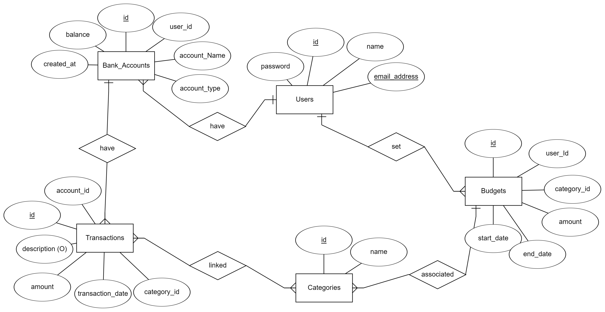

# Design Document for Personal Finance Manager

## By Kholod Fathy

## [Video Overview](https://youtu.be/ze0Wl23qPYg)

## Project Overview

The **Personal Finance Manager** project will allow users to track their bank account balances, transactions, budgets, and expenses. The system is designed to help individuals manage their finances more effectively by offering tools to monitor spending, manage budgets, and keep an eye on account balances.

## Purpose

The purpose of the Personal Finance Manager database is to provide users with a simple and effective way to manage their finances. This database will allow users to:

- Track multiple bank accounts (checking, savings, credit cards, etc.).
- Record and categorize transactions.
- Set and monitor budgets across various spending categories.
- Get an overview of their financial health, spending patterns, and remaining budgets.

By organizing data into entities such as accounts, transactions, categories, and budgets, this database will help users gain valuable insights into their spending habits and make informed financial decisions.

## Scope

The database will manage four primary aspects of personal finance management:

1. **Users**: Individuals who use the system, each of whom can manage multiple accounts.
2. **Bank Accounts**: Represents the various financial accounts users hold (e.g., checking, savings, or credit cards).
3. **Transactions**: Logs all financial activities (income and expenses) for the user, categorized for better understanding.
4. **Budgets**: Allows users to set spending limits for different categories and track if they are staying within their budget.

## Entities and Relationships

### Entities

1. **Users**
   - `id`: INT (Primary Key, Auto Increment)
   - `name`: VARCHAR(255) (Not Null)
   - `email`: VARCHAR(255) (Unique, Not Null)
   - `password`: VARCHAR(255) (Not Null)

2. **Bank Accounts**
   - `id`: INT (Primary Key, Auto Increment)
   - `user_id`: INT (Foreign Key referencing Users)
   - `account_name`: VARCHAR(255) (Not Null)
   - `account_type`: ENUM('Checking', 'Savings', 'Credit') (Not Null)
   - `balance`: DECIMAL(10, 2) (Not Null)
   - `created_at`: DATE (Not Null)

3. **Transactions**
   - `id`: INT (Primary Key, Auto Increment)
   - `account_id`: INT (Foreign Key referencing Bank Accounts)
   - `category_id`: INT (Foreign Key referencing Categories)
   - `amount`: DECIMAL(10, 2) (Not Null)
   - `transaction_date`: DATE (Not Null)
   - `description`: TEXT

4. **Categories**
   - `id`: INT (Primary Key, Auto Increment)
   - `name`: VARCHAR(255) (Not Null)

5. **Budgets**
   - `id`: INT (Primary Key, Auto Increment)
   - `user_id`: INT (Foreign Key referencing Users)
   - `category_id`: INT (Foreign Key referencing Categories)
   - `amount`: DECIMAL(10, 2) (Not Null)
   - `start_date`: DATE (Not Null)
   - `end_date`: DATE (Not Null)

### Relationships

- **Users** to **Bank Accounts**: One-to-Many (a user can have multiple accounts).
- **Bank Accounts** to **Transactions**: One-to-Many (each account can have multiple transactions).
- **Categories** to **Transactions**: One-to-Many (each category can include many transactions).
- **Users** to **Budgets**: One-to-Many (each user can set multiple budgets).
- **Categories** to **Budgets**: One-to-Many (each budget is assigned to a specific category).

### Entity Relationship Diagram (ERD)

The ERD illustrates the connections between the entities. Key points:

- Each user can have multiple bank accounts, but each account belongs to only one user.
- Each bank account can record many transactions, but each transaction belongs to only one account.
- Each transaction is assigned a category for better financial tracking.
- Users can create budgets for different spending categories, and the system will track if their spending exceeds the set limits.

## Optimizations

1. **Indexes**:
   - Indexes will be added on `user_id`, `account_id`, and `category_id` in relevant tables to optimize the speed of queries and retrievals.
   - For example: `CREATE INDEX idx_user_id ON Bank_Accounts(user_id);` to quickly retrieve all accounts associated with a user.

2. **Views**:
   - Views can be created to offer a quick summary of financial data. For instance, a view that shows the total balance across all accounts or the total amount spent in a specific category.

3. **Constraints**:
   - Constraints such as ensuring a non-negative `balance` in bank accounts (`CHECK (balance >= 0)`) and limiting valid `account_type` values (checking, savings, credit) help maintain data integrity.

## Limitations

1. **Single Currency**:
   - This system assumes all transactions are in a single currency, which might limit its use in regions where multiple currencies are commonly used.

2. **No Historical Balances**:
   - The system only stores the current balance of accounts. There is no history tracking of balances over time.

3. **Basic Budgeting**:
   - The budgeting feature is simple, tracking spending limits per category, without advanced features like rollover budgets or savings goals.

4. **Security**:
   - Passwords are stored as plain text in this version, which would need to be improved in a real-world system using encryption techniques for security.
